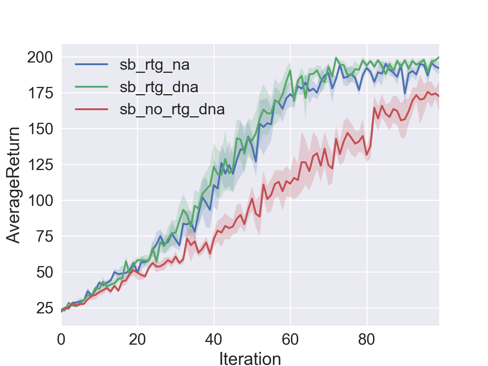
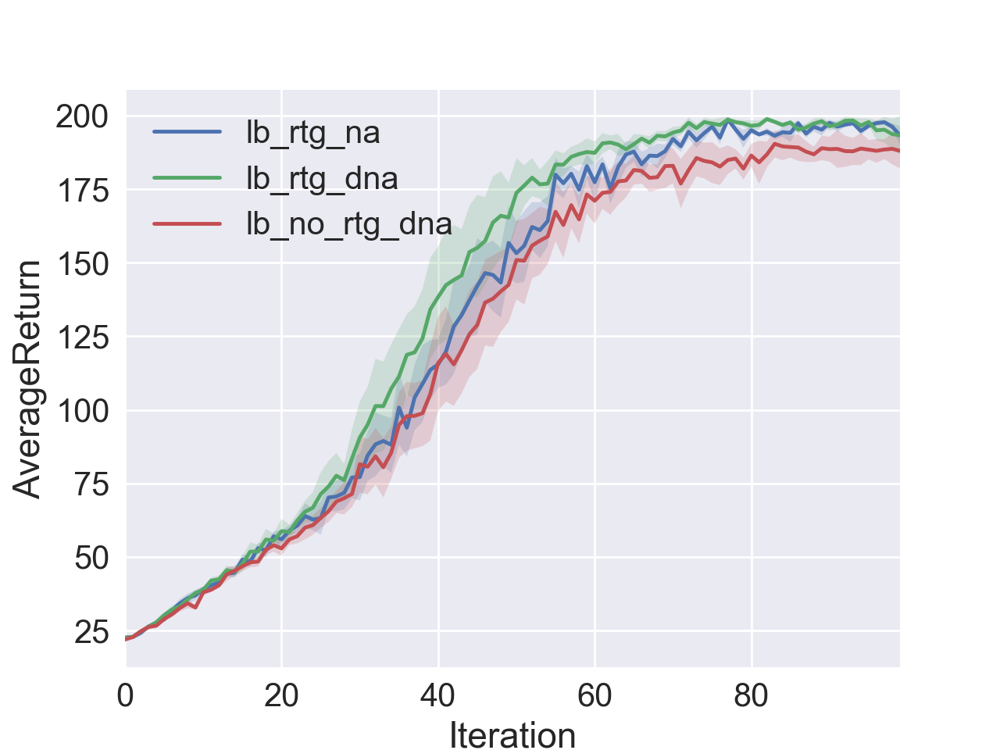
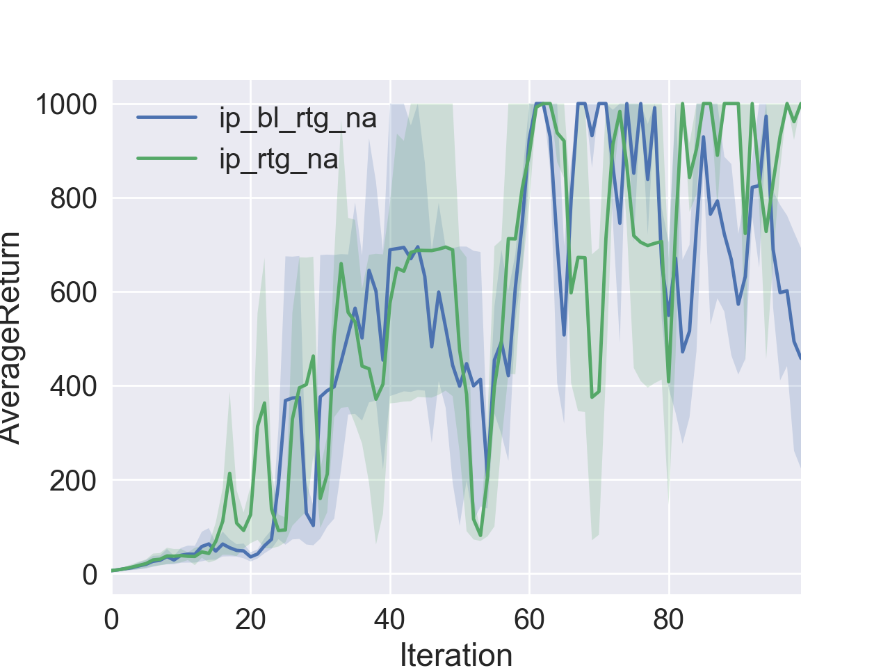
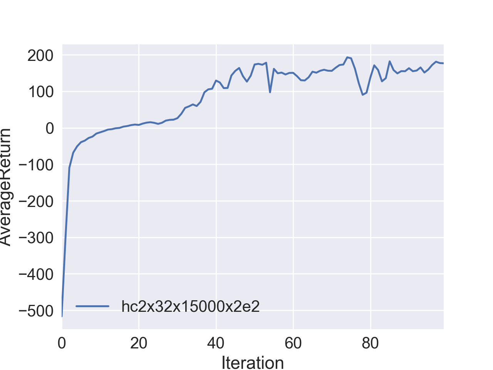

# Homework 2 Report, Policy Gradient Deep RL

_Author_     James Le

## Summary

For this homework, I have completed implementing policy gradient for both discrete and continuous action spaces, implementing reward to go (discount reward by current timestep instead of the begining of the trajectory), implementing advantage normalization and implementing neural network baseline (set baseline to predictions of NN rather than mean of sampled trajectory). I have shown that the algorithm could converge to the optimal score of 200 in CartPole game. I compared the performances for CartPole game using different parameters including network sizes, batches size, turning on/off reward to go and advantage normalization. I have shown that the algorithm could converge to the optimal score of 1000 in the InvertedPendulum game (1D, continuous action space) in 100 iterations, and could achieve an average score > 150 in 100 iterations for HalfCheetah game.

At the bottom of this report I have attached personal "take-away" summaries for this project.

## Answers

1. Compare the learning curves for the CartPole small batches (batch size 1000). There are three different settings: vanilla flavor (sb_no_rtg_dna), with reward to go (sb_rtg_dna), with reward to go and advantage normalization (sb_rtg_na).

   

2. Compare the learning curves for the CartPole large batches (batch size 5000). There are three different settings: vanilla flavor (lb_no_rtg_dna), with reward to go (lb_rtg_dna), with reward to go and advantage normalization (lb_rtg_na).

   

3. Compare the learning curves for small and large batches.

   

4. Command lines that generated the images above

   ```Bash
   # Produce experiments results for CartPole
   python train_pg.py CartPole-v0 -n 100 -b 1000 -e 5 -dna --exp_name sb_no_rtg_dna
   python train_pg.py CartPole-v0 -n 100 -b 1000 -e 5 -rtg -dna --exp_name sb_rtg_dna
   python train_pg.py CartPole-v0 -n 100 -b 1000 -e 5 -rtg --exp_name sb_rtg_na
   python train_pg.py CartPole-v0 -n 100 -b 5000 -e 5 -dna --exp_name lb_no_rtg_dna
   python train_pg.py CartPole-v0 -n 100 -b 5000 -e 5 -rtg -dna --exp_name lb_rtg_dna
   python train_pg.py CartPole-v0 -n 100 -b 5000 -e 5 -rtg --exp_name lb_rtg_na
   ```

   ​

5. Answer questions

   - Which gradient estimator has better performance without advantage-centering: the trajectory-centric one, or the one using reward-to-go?

     **From the figures for small / large batches, reward-to-go seems to learn faster from the begining and performs better**.

   - Did advantage centering help?

     **Didn't help in my set up, with reward to go turned on.**

   - Describe what you expected from the math—do the empirical results match the theory?

     **TODO**

   - Did the batch size make an impact?

     **Yes, the larger batch size results in a smoother learning curve (less variations) and seems to learn faster (in terms of # of iterations)**

6. Display a learning curve for InvertedPendulum-v1

   ```bash
   python train_pg.py InvertedPendulum-v1 -n 100 -b 1000 -e 5 -rtg --exp_name ip_sb_rtg_na --learning_rate 1e-2 --n_layers 2 --size 16
   ```

   

7. Implement NN Baseline

   Contrary to expectation, this does not seem to make a big impact on the variations. It's possible that this resulted from the small batch size I used?

   ```bash
   python train_pg.py InvertedPendulum-v1 -n 100 -b 1500 -e 3 -rtg --exp_name ip_rtg_na --learning_rate 3e-2 --n_layers 2 --size 16 --seed 13
   python train_pg.py InvertedPendulum-v1 -n 100 -b 1500 -e 3 -rtg -bl --exp_name ip_bl_rtg_na --learning_rate 3e-2 --n_layers 2 --size 16 --seed 13
   ```

   

8. HalfCheetah achieved average score of >150 in 100 iterations.

   ```bash
   python train_pg.py HalfCheetah-v1 -ep 150 --discount 0.9 --exp_name hc2x32x15000x2e2 -n 100 -b 50000 -e 1 --learning_rate 4e-2 -rtg --n_layers 2 --size 32 --seed 17
   # The performance varies across seed a lot. This seed is selected because it performs well. Seeds tried include 27, 37, 47, 57. None could achieve >150 in 100 iterations.
   ```

   

## Takeaway

1. Large batch stabalizes learning process: it allows training loss to smoothly decrease, avoid variations and potentially speeds training up (in terms of iteration #).
2. Reward to go helps training faster in infinite loop game.
3. Advantage normalization on paper seems to be able to stablize training but in reality not necessarily.
4. The network does not need to be too deep / large. Small network (For HalfCheetah v1, 2*32 in this case) could be enough. Prioritize optimizing other parameters in training.
5. My dumb tensorflow misc:
  1. `tf.nn.softmax_cross_entropy_with_logits` does not like output layer that has been softmax activated. See [Official Doc](https://www.tensorflow.org/api_docs/python/tf/nn/softmax_cross_entropy_with_logits).
  2. Use `tf.nn.sparse_softmax_cross_entropy_with_logits` to skip hot coding.
  3. `tf.train.AdamOptimizer` is considered preferred to `GradientDescentOptimizer`, see [this post](https://stats.stackexchange.com/questions/184448/difference-between-gradientdescentoptimizer-and-adamoptimizer-tensorflow). On a high level it varies the step size (learning rate) by using the _moving averages of the parameter_.
  4. Fetch desired tensor in `sess.run([tensor_a,b,c,d], feed_dict={})` See [Official Doc](https://www.tensorflow.org/versions/r0.12/api_docs/python/client/session_management#Session.run). Execute nn update by fetching the updating_op: `sess.run(update_op, feed_dict={...})`.
